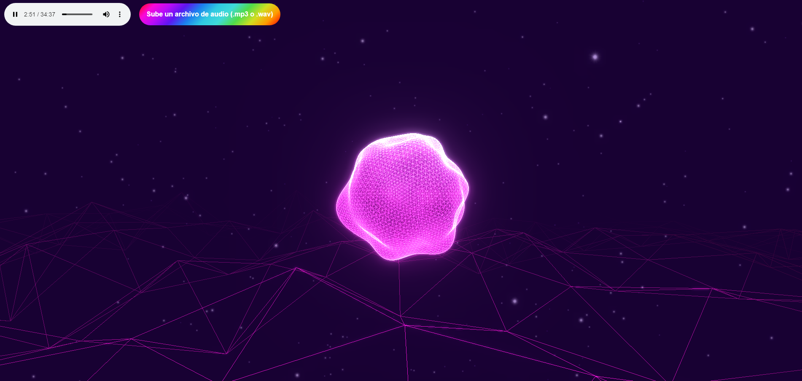

# WebGLMusicVisualizer

<p align="center">
    <a href="https://jorgegiovannetti.github.io/WebGLMusicVisualizer/">
        
    </a>
    <p align="center">
        Try out the visualizer
        <a href="https://jorgegiovannetti.github.io/WebGLMusicVisualizer/">
            here
        </a>
    </p>
</p>

## Introduction

This is a music visualizer for ambience with procedurally generated graphics that react to the music. This project was developed on WebGL using [three.js](https://threejs.org/).

The user can upload **audio/mpeg**, **audio/wav** files to be processed and listened to while the application generates graphical visualizations based on the frequency sequences generated with **STFT (Short-Time Fourier Transform)** through the Web Audio API built-in analyzer.

## Usage

1. Clone or download the repository:

```
git clone https://github.com/JorgeGiovannetti/WebGLMusicVisualizer.git
```

2. Install dependencies:

```
npm install
```

3. Run it locally:

```
npm run dev
```

## Other resources

[An introduction to Fourier analysis with applications to music](https://scholarship.claremont.edu/cgi/viewcontent.cgi?referer=&httpsredir=1&article=1142&context=jhm) \
[Short-Time Fourier Transform explained](https://www.youtube.com/watch?v=-Yxj3yfvY-4) \
[Web Audio API](https://developer.mozilla.org/en-US/docs/Web/API/Web_Audio_API)

## Developed by

[Jorge Giovannetti](https://github.com/JorgeGiovannetti) \
[Daniel David](https://github.com/Danyboyyy) \
[Oscar Rodríguez](https://github.com/dmosc)
